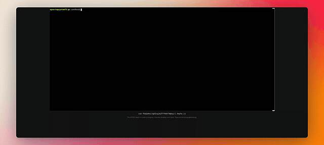

# 🐍 Deep Research Assistant PY

An AI-powered research tool in Python that helps you explore topics in depth using AI and web search.

## Save 200 dollars a month and use this tool

⭐ A python port with a little more cli pizzazz of [https://github.com/dzhng/deep-research](https://github.com/dzhng/deep-research) 

Contribute all you want to this. It was fun tweaking it.

[video demo](https://app.arcade.software/share/e6N8mBQlAMbdc0dmOuS1)



## Project Structure

```plaintext
deep_research_py/
├── run.py              # Main CLI interface
├── deep_research.py    # Core research logic
├── feedback.py         # Follow-up question generation
├── prompt.py           # System prompts for AI
└── ai/
    ├── providers.py    # AI service configuration
    └── text_splitter.py # Text processing utilities
```

## Features

- **Interactive Research**: Asks follow-up questions to better understand your needs
- **Depth Control**: Customize research breadth and depth
- **Web Integration**: Uses Firecrawl for reliable web content extraction
- **Smart Synthesis**: Combines multiple sources into coherent findings
- **Beautiful CLI**: Rich text interface with progress tracking
- **Markdown Reports**: Generates well-formatted research reports

## Installation

`uv tool install deep-research-py`


## Configuration

Set your API keys as environment variables:

```bash
# Required: OpenAI API key
export OPENAI_API_KEY=your-openai-key-here

# Required: Firecrawl API key
export FIRECRAWL_KEY=your-firecrawl-key-here
```

## Usage

Run the research assistant:

```bash
deep-research
```

You'll be prompted to:
1. Enter your research topic
2. Set research breadth (2-10, default 4)
3. Set research depth (1-5, default 2)
4. Answer follow-up questions
5. Wait while it researches and generates a report

## Development Setup

Clone the repository and set up your environment:

```bash
# Clone the repository
git clone https://github.com/epuerta0/deep-research-py.git
cd deep-research-py

# Create and activate virtual environment
uv venv 
source .venv/bin/activate

# Install in development mode
uv pip install -e .

# Set your API keys
export OPENAI_API_KEY=your-openai-key-here
export FIRECRAWL_KEY=your-firecrawl-key-here

# Run the tool
deep-research
```

## Requirements

- Python 3.9 or higher
- OpenAI API key (GPT-4 access recommended)
- Firecrawl API key for web search
- Dependencies:
  - openai
  - firecrawl-py
  - typer
  - rich
  - prompt-toolkit
  - aiohttp
  - aiofiles
  - tiktoken

## Output

The tool generates:
- A markdown report saved as `output.md`
- List of sources used
- Summary of key findings
- Detailed analysis of the topic

## License

MIT

## Contributing

Contributions are welcome! Please feel free to submit a Pull Request.

